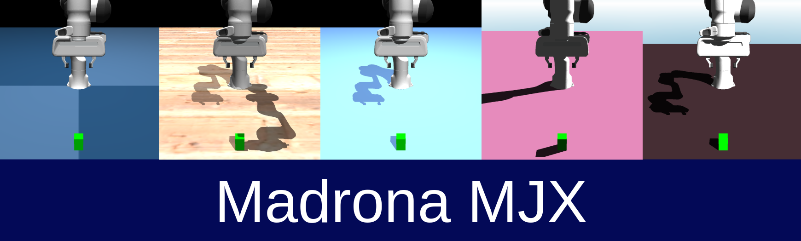

# Madrona MJX

<h1>
  <a href="#"></a>
</h1>

## Overview
Madrona MJX is a bridge between the [MJX](https://mujoco.readthedocs.io/en/stable/mjx.html) physics engine and [Madrona](https://madrona-engine.github.io)'s Batch Renderer used as a library that provides high-throughput batch rendering within MJX for training vision-based policies. Madrona MJX allows for the MJX data structures to be passed to Madrona for rendering. This interactions happens directly on the GPU, resulting in physics and rendering to occur efficiently on device. This results in rendering FPS in the hundreds of thousands.

Visit the [walkthrough](https://github.com/shacklettbp/madrona_mjx/blob/main/docs/WALKTHROUGH.md) for a detailed introspection of this project. For those interested in integrating the Madrona renderer with other simulators, please refer to this document
detailing the [integration](https://github.com/shacklettbp/madrona_mjx/blob/main/docs/INTEGRATION.md) process.


## Features
- High throughput Batch Renderer
- Raytracer (recommended) and Rasterizer backend options
- Integration with MJX, Playground, and Brax vision training pipelines
- Domain Randomization capabilities for vision properties
- Configurable lighting with shadows, including both directional and spotlights which can move. (Raytracer Only)
- Variable number of cameras per world


## Installation

Currently Madrona-MJX requires building the renderer from source, then locally installing a Python wrapper for the renderer.

1. Install the following libraries: `sudo apt install libx11-dev libxrandr-dev libxinerama-dev libxcursor-dev libxi-dev mesa-common-dev`

2. Install [Cuda 12.5.1]([url](https://developer.nvidia.com/cuda-12-5-1-download-archive)) or earlier. [Cudnn](https://developer.nvidia.com/cudnn) will be required for the upcoming local Jax install.

3. Install Jax using `pip install -U jax["cuda12"]`. Sometime Jax will pull a different version then your local CUDA binaries, to avoid this you can try `pip install "jax[cuda12_local]"`

4. Install MuJoCo and MuJoCo MJX `pip install -U mujoco mujoco-mjx`
    - `madrona_mjx` requires version >= 3.2.7

5. Install `madrona_mjx`


```sh
git clone https://github.com/shacklettbp/madrona_mjx.git

cd madrona_mjx
git submodule update --init --recursive
mkdir build
cd build
cmake ..
make -j

cd ..
pip install -e .
```

> if using uv, you can use `uv pip install -e .`

> If you are on a machine which doesn't have Vulkan installed (i.e., when you run a script, you run into an assertion failure at `madrona::render::vk::Backend::Init::init`), make sure to replace `cmake ..` with `cmake -DLOAD_VULKAN=OFF ..` so that the application doesn't try to load Vulkan.

- In the case that running `cmake` does not work, check your cmake version with `cmake --version` and try updating to at least [cmake 3.31.0](https://github.com/Kitware/CMake/releases/download/v3.31.0-rc2/cmake-3.31.0-rc2-linux-x86_64.sh).

```
sudo apt remove --purge cmake
pip install cmake
cmake --version # Should be 3.31+
```

## Getting Started

The best way to get started with `madrona_mjx` is through its integration with [MuJoCo Playground](https://github.com/google-deepmind/mujoco_playground).

For tutorials on using MuJoCo Playground with Madrona-MJX, see:

1. Training CartPole from Vision  [](https://colab.research.google.com/github/google-deepmind/mujoco_playground/blob/main/learning/notebooks/training_vision_1.ipynb)


## Usage

Madrona-MJX can be used in two ways, by launching a viewer that is hooked to a visualization loop, or headless which can be used in a training loop. 

> Currently visualization during training is not supported

#### Launching the viewer

A viewer script is provided that can be used to view mjcf files using the Madrona viewer. Let's launch the viewer with a cartpole mjcf.

```sh
python scripts/viewer.py --mjcf data/cartpole.xml
```

The viewer includes a world view and a batch render view. *The viewer is not representative of what the true
batch renderers are outputting, as it uses a different renderer*. To visualize what the batch 
renderers are visualizing, we have included a small debug window that shows the output 
of the rgb and depth for the current world. The worlds can by cycled in the options UI.

We can also load robotics examples examples from the Mujoco Menagerie. Let's 
try loading a Franka Emika Panda robot scene.

```sh
./scripts/create_franka_example

python scripts/viewer.py --mjcf mujoco_menagerie/franka_emika_panda/mjx_single_cube_camera.xml --num-worlds 16 --window-width 2730 --window-height 1536 --batch-render-view-width 64 --batch-render-view-height 64
```

### Training

For vision training examples and sample usage, please visit MuJoCo Playground, where `madrona_mjx` is integrated into environments with complete vision-based training examples.


## Important Tips

1. Madrona compiles a set of CUDA kernels during initialization. Compilation is expensive, and so Madrona caches and re-uses these kernels after the first compilation if you pass an environment variable. This allows you to skip the compilation step!

    To use caching, set the following environment variables prior to your command.

    - `MADRONA_MWGPU_KERNEL_CACHE`: set this to the path to the Madrona megakernel cache.
    - `MADRONA_BVH_KERNEL_CACHE`: set this to the path to the BVH kernel cache.

    Run the following command twice to see how this works:
`MADRONA_MWGPU_KERNEL_CACHE=build/kernel_cache MADRONA_BVH_KERNEL_CACHE=build/bvh_cache python scripts/viewer.py --mjcf mujoco_menagerie/franka_emika_panda/mjx_single_cube_camera.xml`


2. A camera must be included in the mjcf. Expect a crash if you do not have one.

3. The MJX Model passed to initialize the Madrona Renderer must be batched such that the arrays are of shape [num_worlds, ...]. This is because Madrona will attempt to copy the data buffers and expects data for all worlds to be present. This means that MJX model attributes that are not Domain Randomized must be tiled manually. See `wrapper.py` for an example identity randomization that tiles the data.

4. Only one renderer can be initialized at a time. This means two environments cannot be created that both use their own batch renderer instances. (e.g. train/eval)

5. The number of worlds must be known and initialized at the very beginning. All future rendering will render all worlds, there is no way to disable or not render certain worlds. (implication is that train/eval must have same batch size)

6. The `MADRONA_MWGPU_DEVICE_HEAP_SIZE` environment variable can be used to change how much memory Madrona pre-allocates. If you are using hardware that has limited GPU memory, you can adjust this value, but you will need to identify how much memory is required for your use case. Not allocating enough memory will throw an error.

## Feature Parity
> Not every attribute of the MJX data structures can be rendered by Madrona.

The following features are supported:
- Rigid body rendering, along with position and rotation changes
- Camera position and rotation changes
- Light position and rotation changes
- Geometry color, size, and texture domain randomization
- Light parameter domain randomization


The following features are *not* supported:
- Deformable bodies
- Particle systems
- Musles, Tendons, Composites (Except for any rigid body components)


## Citation
--------
If you use Madrona-MJX in your scientific works, you can cite the following relevant papers:

High-throughput rendering in Madrona
```bibtex
@article{rosenzweig24madronarenderer,
    title   = {High-Throughput Batch Rendering for Embodied AI},
    author  = {Luc Guy Rosenzweig and Brennan Shacklett and
               Warren Xia and 
               Kayvon Fatahalian},
    conference = {SIGGRAPH Asia 2024 Conference Papers},
    year    = {2024}
}
```

Mujoco Playground
```bibtex
@misc{mujoco_playground_2025,
  title = {MuJoCo Playground: An open-source framework for GPU-accelerated robot learning and sim-to-real transfer.},
  author = {Zakka, Kevin and Tabanpour, Baruch and Liao, Qiayuan and Haiderbhai, Mustafa and Holt, Samuel and Luo, Jing Yuan and Allshire, Arthur and Frey, Erik and Sreenath, Koushil and Kahrs, Lueder A. and Sferrazza, Carlo and Tassa, Yuval and Abbeel, Pieter},
  year = {2025},
  publisher = {GitHub},
  url = {https://github.com/google-deepmind/mujoco_playground}
}
```


